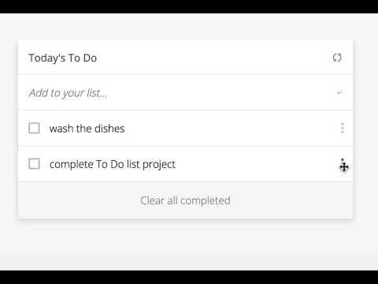

# TO DO LIST PROJECT ES6
This repo is created to contains to do list project files. In this project I used ES6.

## Overview

In this project, we built a basic website that allows users to prepare to do list. This was achieved by using JavaScript objects and arrays, while using javascript DOM and basic events to dynamically modify the page.

## Project Tasks List

- [x]  Add a new JavaScript file and import it as a module:
- [x] it will contain methods related to the status updates (completed: true / false).
- [x] Add event listener to the checkbox (change).
- [x] Update items object's value for completed key upon user actions.
- [x] Implement a function for the "Clear all completed" button (use filter() method).
- [x] Store the updated array of items in local storage, so the user gets the correct list values after the page reloads.

## Screenshots

<h3 align="center">Screenhot</h3>

  

## Live Demo (if available)
Live Demo [Link](#)

## Getting Started
Simply you can open index.html file with any browser and, you will see the home page.
for opennig index.html go to awesome-books directory, find index.html, right click on it, click on open with and, click on any browser which is available on your pc/labtop. 

### Browser## Built With

- [HTML](https://developer.mozilla.org/en-US/docs/Web/HTML)
- [JavaScript](https://developer.mozilla.org/en-US/docs/Web/JavaScript)
- [CSS](https://developer.mozilla.org/en-US/docs/Web/CSS)

### Prerequisites

- Internet connection
- A github account

## Author
### 🧑🏻 Author1
- GitHub: [@EngruugbeJimmy](https://github.com/EngruugbeJimmy)
- Twitter: [@abbaJdev](https://twitter.com/abbaJdev)
- LinkedIn: [abah-james-ugbede](https://www.linkedin.com/in/abah-james-ugbede-356982159/)

### 🤝 Contributing
Contributions, issues, and feature requests are welcome!
Feel free to check the issues page.
## Show your support
Give a ⭐️ if you like this project!

## Acknowledgments
- Hat tip to anyone whose code was used
- Inspiration
- etc
## 📝 License

This project is [MIT](https://github.com/git/git-scm.com/blob/main/MIT-LICENSE.txt) licensed.

NOTE: we recommend using the MIT license - you can set it up quickly by using templates available on GitHub. You can also use any other license if you wish.

